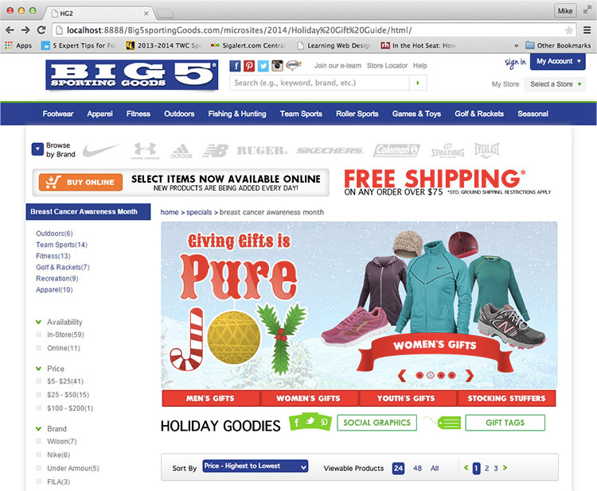

  
`big5sportinggoods.com`  

# Dates:  
2014  
# Technologies:  
HTML5, CSS3, jQuery plugin  
# Description:  
This microsite helps the holiday shopper with different gift ideas. Along the right side within the hero banner there is a jQuery plugin carousel called [Flexslider by WooThemes - http://www.woothemes.com/flexslider](http://www.woothemes.com/flexslider/) which rotates between different categories and shows some of the gifts available. The navigation on the bottom has links to the different categories in the carousel. Below that are links to social graphics and gift tags which can be downloaded by shoppers to use on their gifts.  

In the **index.html**,  
the CSS styles I created are between the comments  
`<!-- Michael de Leon's CSS styles.  CUT HERE. CUSTOM CSS BEGIN -->`  
and  
`<!-- Michael de Leon's CSS styles.  CUT HERE. CUSTOM CSS END -->`  

My HTML code is between the comments  
`<!-- Michael de Leon's code.  CUT HERE. CUSTOM CODE BEGIN -->`  
and  
`<!-- Michael de Leon's code.  CUT HERE. CUSTOM CODE END -->`  
# Screenshots:
  
